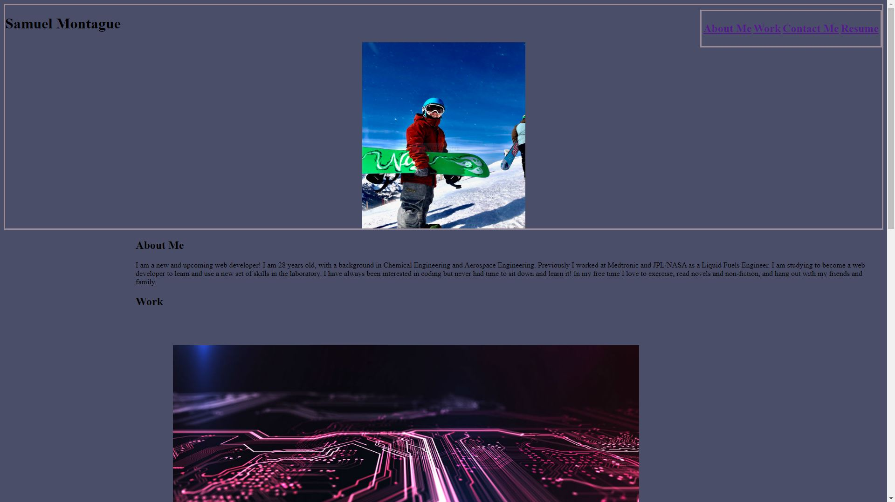

# hw2-portfolio
The second homework project for the bootcamp

I was tasked with creating my own web-developer portfolio page. 

my portfolio page opens with the correctly regardless of the screen size.
when clicking on the link in the navigation the page scrolls to corresponding section.
when clicking on my "works" there is a hover and link with a page of my git hub repo for the selected project.
my first application is larger than the rest so the viewer knows which one to select first.
while styling my page i selected colors that i thought would go well with my personality.

